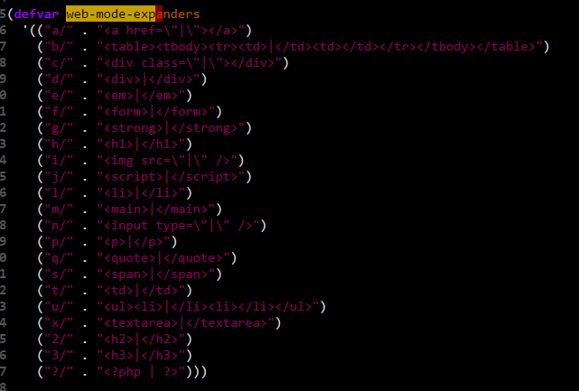

# Emacs Basic Customization and Package Configuration #
## Adding and Configuring New Modes ##
If you always want the elsip package or code to run at start, just use require in the init.el, ex. `(require modecode.el)`. To make emacs load quicker though, use autoload it only loads the code when that specific mode is required, it requires you to use the eval-after-load or mode hooks to configure the mode since you didn't do it at the start. A more relevant reference for all of this is my [my-packages.el](https://github.com/dfeagans/dotfiles/blob/master/.emacs.d/my-packages.el).

### When to Use eval-after-load ###
- `eval-after-load` is loaded once when a certain feature or file is first loaded, so a keymap-change clearly goes inside one of these. Not the least because the keymap may not be known at init-time. Try something like `(define-key message-mode-map (kbd "C-c f") 'Footnote-add-footnote)` in `emacs -q`. A hook is not a nice solution here since it binds the function to a key every time the hook is started. As tarsius notes, you can read more about why not to local-set-key in hooks.
- Finally, note that `with-eval-after-load` of GNU Emacs 24.4 is a 2 line wrapper around `eval-after-load` where `body` need not be quoted.

###When to Use Hooks ###
Hooks are list of functions loaded every time a criterion is met, e.g. a certain mode is started. A common use of hooks is to load minor-modes, such as flyspell-mode or hl-line-mode, ex. `(add-hook 'org-agenda-mode-hook 'hl-line-mode)`. As Rémi points out, add-hooks is smart and will do the right thing even if the hook-variable has yet to been loaded.

# Additional Modes and Packages #
## Ido Mode ##
Makes the find-file command `C-x C-f` more powerful. It displays all the files in the directory and lets you fuzzy search them. For example, "tfr" would find totally_friggin_rad as a match. It can cause problems when you're wanting to create a new file, such as READ when there's already a README, but hitting C-j will make it so it just uses the READ to create a file. Otherwise, hit tab to complete the README then C-j (you could just hit enter, but I'm trying to stay on the home row).

## [yasnippet Mode](https://github.com/joaotavora/yasnippet/blob/master/README.mdown) ##
This mode lets you have a library of snippets for each mode, that expand to complex code when you hit `tab`. For example, in a markdown file, typing "h2" then hitting `tab` would change to "## Header 2 ##" and let you type in the header name.

`Tab` is used by auto-complete as well. To get that to jibe, my customizations use yasnippet to populate that auto-complete menu, and auto-complete then calls yas-expand. That was done by adding `ac-source-yasnippet` to the list of default `ac-sources`.

The way it works is that yasnippet has a directory for each modes' snippets that is automatically uses when that mode is active ex. js-mode uses the snippets in the ~/.emacs.d/elpa/yasnippet-IDnumber/snippets/**js-mode** dir. It's possible to use other modes besides the ones specified for the current mode though. This is what I use to get js-mode yasnippets in web-mode: `(add-hook 'web-mode-hook (lambda() (yas-activate-extra-mode 'js-mode)))`.

`TAB` = lets you jump between different fields in the expanded snippet.

`m-x yas-describe-tables` = Lets you view all the snippets available for the current mode.

## Auto-Complete Mode ([github](https://github.com/auto-complete/auto-complete) / [manual](http://auto-complete.org/doc/manual.html#auto-complete-command)) ##
This mode lets you auto-complete using "TAB." My emacs init.el starts with the default configuration and then adds to it.

### Controls: ###
- `TAB`= automatically complete, if it's a snippet, it gets expanding.
- `C-g` = cancels auto-complete menu
- `C-n` and `C-p` = lets you navigate up and down the list to select with tab.

`ac-modes` variable controls what modes (and indirectly what file-types) auto-complete is active for. I turned it on for markdown-mode and fundamental-mode in configuration file, otherwise it's reasonably complete.

`ac-disable-faces` controls what type faces auto-complete is disabled for. The default includes comments and strings, but I setq it to nil so that I have autocomplete everyplace. 

### Auto-Complete Source Configuration: ###
You can define what sources are used for auto-complete. I use auto-complete-config.el (the default auto-complete configuration script) because it integrates yasnippet nicely. It also provides a function (ac-config-default) that sets up the following default ac-sources for everytime auto-complete-mode is active: `ac-source-abbrev` / `ac-source-dictionary` / `ac-source-words-in-same-mode-buffer`.

I added `ac-source-yasnippet` to that default list so that auto-complete becomes a front-end for the snippets.  Additionally, it's possible to add hooks to add more sources for each mode locally when it opens. ac-config-default does this for some modes, but if you want to create your own, you just have to create a function that adds those sources:

```elisp
(defun ac-customMode-setup ()
  (setq ac-sources (append '(extra-source-I-want extra-source-I-also-want) ac-sources)))
```

It might be nice to create an entirely separate `ac-sources` for that mode (to avoid using the default sources). If you want to do that, just change the above to:

```elisp
(setq ac-sources '(ac-source1 ac-source2))
```

Then create a hook to load that function when the specific mode is activated: `(add-hook 'customMode-hook 'ac-customMode-setup)`
It's possible to do all that in one step using lambda()(), for example: `(add-hook 'c++-mode (lambda () (add-to-list 'ac-sources 'ac-source-semantic)))`

##Dired Mode (Directory Edit) ##
- `C-x d` = enters dired mode to navigate and manipulate directories.
  - `Enter` = Opens file/directory
  - `q` = close the dir 
  - `C` = copy file (prompts for new name)
  - `R` = rename/move file
  - `D` = delete file
  - `+` = creates new directory
  - `Z` = compress/decompress using gzip
- Working with multiple files
  - `m` = mark a file (or multiple files)
  - `u` = unmark
  - `U` = unmark all
  - `%m` = mark with regex (ex select htmls with \.html$)
- Navigation
  - `g` = refresh dir listing
  - `^` = go to parent dir

## [MARKDOWN MODE](http://jblevins.org/projects/markdown-mode/) ##
Eventually, I started to manage my task-lists using a markdown file in Emacs (it was nice having the list in text so I could version control it in Git). To get markdown syntax highlighting and organizational tools I used markdown-mode.

Key-Bindings:
`f8` (markdown-shifttab) = cycles globally through top-level headings, all headings, and view all of the document.
`C-\\` and `TAB` (markdown-cycle) = locally expand or collapse the current heading you over. (C-\\ matches the code folding I have set-up in other modes). `TAB` is the default and is a lot easier though.
`M-Arrows` = Left and Right arrow promote demote. Up and Down arrows raise and lower item in the list.
`C-c C-t #` = t stands for title, the # (1-5) corresponds to the header.
`C-c -` = horizontal rule

`C-c C-n` Move to next visible heading
`C-c C-p` Move to previous visible heading
`C-c C-f` Move to next visible heading at same level
`C-c C-b` Move to previous visible heading at same level
`C-c C-u` Move up to a lower-level heading

Sometimes it's useful to link to other parts throughout your markdown. This can be done using:
```markdown
## Title Heading<a id="headin"></a>
BUNCH_OF_OTHER_TEXT
[This is the link text](#headin)  <--- This gets turned into this html --->  <a href="#headin">This is the link text</a>
```

## [Ace-Jump Mode](https://github.com/winterTTr/ace-jump-mode) ##
Let's you jump to different sections on the screen quickly.

#### Key-Bindings: ####
- `C-c SPC` = lets you enter a character to jump to. Then select whatever key identifies it to jump to it.
- `C-x SPC` = lets you jump back to your original mark.

## [HideShow Mode (hs-minor-mode)](http://www.emacswiki.org/emacs/HideShow) ##
I've made it so that `C-\` toggles folding/unfolding the current section and <f6> toggles folding/un-folding everything.

##WriteGood-Mode (stopped using this) ##
https://github.com/bnbeckwith/writegood-mode  
http://bnbeckwith.com/code/writegood-mode.html

After downloading the writegood-mode.el and putting it into your .emacs.d directory just add the below to your init.el file.
To toggle writegood-mode ON/OFF, the keybinding below is `C-c g`.

```elisp
;; ---------------------------                                                                           
;; ---- WriteGood Mode -------                                                                           
;; ---------------------------                                                                           
;; USAGE INFO: bnbeckwith.com/code/writegood-mode.html                                                   
;; GIT PAGE: www.github.com/bnbeckwith/writegood-mode                                                    

;; Supply the path to the mode repository                                                                
(add-to-list 'load-path "~/.emacs.d/writegood-mode.el")
(require 'writegood-mode)
;; Set a global key to toggle the mode                                                                   
(global-set-key "\C-cg" 'writegood-mode)
```

## Emacs Key Runs Shell Command ##
I wanted to add a key that compile my jade template after I was done modifying it. I could have just used grunt watch, but that's a bigger project. Putting the below in my .emacs file made it so that hitting f7 runs the shell command below.

```elisp
(global-set-key (kbd "<f7>")
                         (lambda ()
                         (interactive)
                         (shell-command "node /home/ubuntu/dEmail/dEmail.js")))
```

## Replacing the word "function" with "ƒ" in Javascript-Mode (js-mode): ##
Adding the below to someplace in your emacs startup files will replace "function" (note the critical space) with the ƒ character since it get's pretty cluttered.

**In the below I had to replace the ƒ with F since that symbols not available in my terminal:**

```elisp
(font-lock-add-keywords
 'js2-mode `(("\\(function *\\)("
             (0 (progn (compose-region (match-beginning 1) (match-end 1) "ƒ")
                       nil)))))
```

```elisp
(font-lock-add-keywords
 'js2-mode `(("\\(function *\\)("
              (0 (progn (compose-region (match-beginning 1) (match-end 1) "\u0192")
                        nil)))))
```

## HTML-Mode (This is the built-in html minor mode, but I ended up not using it): ##
- `C-c C-t` = prompts for a tag name and attributes, then adds that tag and the closing tag. Very nicely, if you have a region selected, it will add that tag around the region.
- `C-c C-d` = deletes the tags surrounding your point.
- `C-c /` = adds the closing tag for the nearest open tag.
- `C-c C-a` = interactively adds attributes right where your cursor is.
- `C-c C-f` and `C-c C-b` = skips forward and backwards over a balanced group of tags.

## [Web-Mode](http://web-mode.org/) ##
This is set-up to open on html and css files. I've added a lot of automatic functionality using Web-mode (see my-packages.el), but here are some helper functions that web-mode provides:

`C-c C-i` = automatically fixes indentation on the entire buffer.

Because I turned on web-mode auto-expands, when you type the stuff in the left (a/) it will automatically get expanded:


