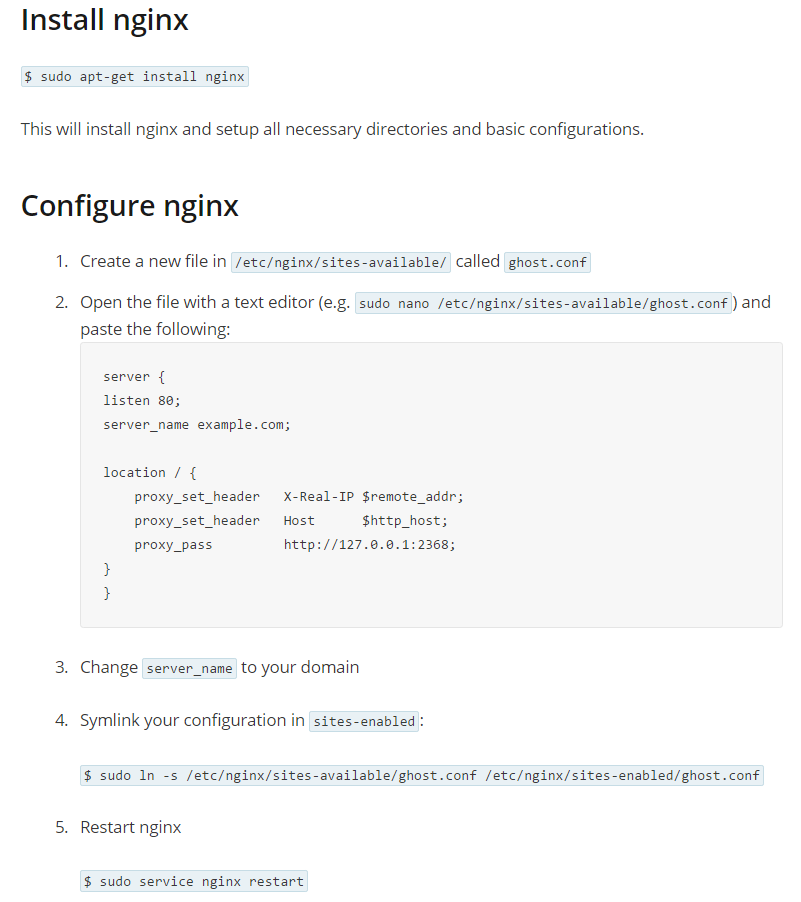

## Ghost Installation and Maintenence Instructions ##
This is the official [install documentation](http://support.ghost.org/developers), but [this guide](http://www.howtoinstallghost.com/how-to-setup-an-amazon-ec2-instance-to-host-ghost-for-free-self-install/) was pretty helpful, but I already had an AWS EC2 Instance up so:

1. Get the install file:
 - Option 1: `wget https://ghost.org/zip/ghost-latest.zip` to download the most recent version.
 - Option 2: Check here for download: https://ghost.org/developers/.
 - Option 3: The third method is to go straight off their git repo using `git clone git://github.com/tryghost/ghost.git` but read the README in the zip file fore mode details if I want to go that route.
 - Option 4: Pretty sure it's possible to use npm to install ghost (just using `npm install ghost`).
2. `unzip -d ghost ghost-latest.zip` to unzip that file into a ghost folder (I had to install unzip first using `sudo apt-get install unzip`).
3. After doing `cs ghost` to get into the folder, `npm install --production` downloads all the dependencies of ghost using npm.

## Running Ghost using Forever ##
Forever is an npm program is used to keep node running when I log off or when it crashes. It will also store logs about the crash.
Install globally using`npm install forever -g` (might have to use `sudo npm install forever -g` to get super user access to it if you want to run it over Port 80).

## Ghost Configuration and Environment Notes: ##
- The config.js controls the ports and url the blog is passed out over for developement and production environments.
- The production stuff has all minified javascript files, while the development is human readable and has more debug stuff output.

To create a config.js from the config.example.js template: `cp config.example.js config.js`, then in the config.js file, change the host and port names to be accessible, the host name should be "0.0.0.0" or the public dns name of your aws instance, or "ec2-184-72-196-208.compute-1.amazonaws.com" in my case. If using a VPC, you won't have a public dns, just a public IP. See below for information on the port numbers.
 
### Port Numbers in the Ghost config.js ###
#### How I first ran it (which is a security concern because Node is running under sudo): ####
I changed the production port to 80 and the development port to 8080.Since the port has been changed to 80, you have to run the program with sudo. You have to use sudo because processes running without root privileges cannot bind to ports below 1024. That's the security concern. The basic commands to get Ghost up are: `sudo npm start --production` to the production settings from config.js or `sudo npm start` will default to the development settings (alternatives are: `sudo forever start index.js` / `sudo forever list` / `sudo forever stop index.js`). The way I ran it originally (before I knew of the security concern was: `sudo NODE_ENV=production forever start index.js`. The NODE_ENV sets the environment variable to production (temporarily) then forever starts ghost.

#### How I ended up running it (avoids the aforementioned security concern): ####
To avoid running node directly on port 80, which would require running node under sudo, the config.js was left with the default 2368 port for ghost and then nginx was used as a proxy to get it to port 80. [These instructions](http://support.ghost.org/basic-nginx-config/) worked perfectly:

Then to get node running under nginx, you just use: `NODE_ENV=production forever start index.js`. Most importantly node is not running under sudo, only nginx.

## AWS Security Settings ##
Regardless of the methods used to run the ghost blog, it needs to be served out over port 80 since browsers default to it, that means it needs to be open in the AWS privacy settings for the AWS instance. If it's not already, just add it to the security group.
 
## Hooking up the Domain Name ##
I bought a domain name from NameCheap.com to get it pointed to the website, I found the AWS systems IP (it's within the DNS name and given to you on the AWS configuration board where you configure your instances. Note it is not the IP given to you by running ifconfig on your aws instance. That's apparently an internal IP, you want the external IP provided by AWS. Then use it to configure the below on NameCheap. The first one handles someone typing `okdane.com` and the www one obviously handles someone typing `www.okdane.com`.
