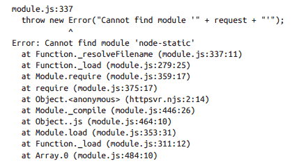

# General Javascript Notes #
Remember to use the "use strict" IIFE in my node code to reinforce good habits. You use the function because if you just write "use strict"; at the top it applies for everything and you don't know if the libraries you're using use strict as well. The function only applies it to whatever's in it.

```javascript
(function() {

    "use strict";

    function doSomething() {
        // this runs in strict mode
    }

    function doSomethingElse() {
        // so does this
    }
}());
```

## Constants ##
When hardcoding constants in, use `VARIABLE_NAME_IN_ALL_CAPS`. Example. `CONTROL_COLUMN = 'hardCodedDirectory'`. ES6 has since added the "const" declaration to make the practice even more robust. `const MY-VAR = 7;` would throw errors anytime the MY-VAR was rassigned to anothre value.

## Default Values ## 
A nice practice is to create a `DEFAULT_SETTINGS` variable that's defined ahead of time to set the default value. Then take "settings" in as arguments to a function or command line input later. Using `var settingToUse = settings || DEFAULT_SETTINGS` would define `settingToUse` as `DEFAULT_SETTINGS` if `settings` had no value; meaning the person didn't manually provide the settings at the command line or function call.

## { Style Rule ##
Always put the { on the same line as the statement to start the habit. If its following an if statement it won't cause any problems being on another line, but if its following a return in a function if you put the { on the next line (like if you were returning a object literal) it wouldn't see it and would return undefined. Therefore, as a habit, always put the { on the same line after the statement.

## MANAGING NODE CALLBACKS ##
### Return Statements in Node Callbacks ###
As [this article](http://www.bennadel.com/blog/2323-use-a-return-statement-when-invoking-callbacks-especially-in-a-guard-statement.htm) explains, use `return cb(...)` to shortcut out of your callback function and avoid running the rest of it. Especially useful if you have a bunch of guard statements before your main callback is called, kind of like in my dEmail [serveResults.js](https://github.com/dfeagans/dEmail/blob/master/serveResults.js), that would return `cb(error)` when the wrong email was entered. It would then avoid running everything else. Remember a callback in a function is just saying apply this function with these parameters, so if it's not the last thing in the function, or if it's not prefaced with return, it's just going to keep plugging until all the lines in the function are done.

###Error Objects ###
The first parameter of the callback in node is supposed to be any errors that occur, otherwise null. It's easy to think that just passing a string back to that parameter is sufficient, because it will trigger any error checking you have set-up (ie it is not null). Using actual error objects though gives more information, like what line, what file, and the call stac though.

### Node Events ###
In the line below, the 'record' event is an event of the csv module. If you look up that module, it says that everyime it records a row, it will call the event function and provide the row and index as the first and second parameters. Then you can define the callback function as such:
```
csv().from.path(csvfile).on('record', function(row, index){ DO SOMETHING WITH row AND index });
```

Some times you want to pass your function extra parameters (in the above example, you might want more than the row and the index).The below example creates a closure to enclose additional parameters into a callback function for later use:

```javascript
//Build the closure function with additional parametesr csvfile and headers. Note that result and response are the parameters fed back from the 'complete' event that's returned by the rest module at the end. The .on() method is a part of node, not rest module.

var buildfn = function(csvfile, headers) {
    var response2console = function(result, response) {
        if (result instanceof Error) {
            console.error('Error: ' + util.format(response.message));
        } else {
            console.error("Wrote %s", csvfile);
            fs.writeFileSync(csvfile, result);
            csv2console(csvfile, headers);
        }
    };
    return response2console;
}

//actual call back function.
rest.get(apiurl).on('complete', response2console);
```

### Loading JSON into files ###
If you have a json you want to use for everything, say a configuration file, all you have to do is `var data = require('./data.json');`. This is a lot quicker than the readFileSync or any other methods, and it cache's it so if other parts of the program use it it's already in memory. Note that json file format requires double quotes around everything except numbers. Don't use single quotes.
 
## require.main ##
The way to tell whether your program was called from the command line vs. from within another piece of code is checking whether `require.main == module`. If that's true, then someone typed `./yourNodeProgram.js` on the command line. This is useful for doing extra things with your program when it's called from the command line, but then it's called from a `var newModule = require('./yourNodeProgram');` expose simpler functionality.

## process.argv ##
To make the node program more useful from the command line, you can use the special `process.argv` parameter to read in the command line input and options. It's an array of everything entered on the command line. If your node program was run using `node example.js -y testText`, `process.argv[0]` is "node", the second, `process.argv[1]` would be example.js, `process.argv[2]` would be "-y", etc.

## Stack Trace (excerpt from Node.JS for PHP Developers PDF) ##


The image above shows a stack trace from when a module was requested but didn't exist. The first line is the line that threw the error, but not necessarily caused the error. Next, the actual error message. The remainder is the "call stack" it's the list of functions that actually called the error line, from inside (most recent) out to largest "scope".

## WriteFile ##
Super basic, but the difference between **synchronous** file write `(fs.writeFileSync(filename, data, [options]))` and **assynchronous** file write `(fs.writeFile(filename, data, [options])`. Syncronous blocks everything until the write is done. Asynchronous file write allows other operations to still occur, it will still block operations that require the file though.

## Cache Elements in jQuery ##
When you write `$('#menu').fadeTo...` it looks at the whole DOM and checks if there are any ID's="menu" everytime. So if you fade it, change color, call another function, etc. It wastes time climbing the DOM tree everytime. The below code caches a variable called "$myDiv" to be called later for all the operations. On the variable definition it looks through the whole DOM like normal for a menu ID, but after that it knows exactly where to go.
  
### Slow Selection Version ###
```javascript
$("#myID").hide();
// Do other stuff.
$("#myID").show();
```

### Quicker Cached Version ###
```javascript
var $myDiv = $(“#myID”)
$myDiv.hide();
// Do other stuff.
$myDiv.show()
```
  
The other option is chainging jQuery operations for increased speed. If you are doing `$('div').hide();` and `$('div').fadeIn('slow',1);` chain it all so that it only has to find the element once `$('div').hide().fadeIn('slow',1);`.

## Error Catching ##
Common error catching structure is: 

```javascript
try
{
    //Code that might cause an error.
}
catch(er)
{
    //Code to be executed upon error from about. The er variable catches the error and lets you get more info using er.name, er.message, er.number, and er.description. 
} 
finally {
    //Code to be executed no matter what
}
```

If you want to throw your own errors (say after some logic that tests whether valid input, you can create your own error to throw using: `throw new Error("Fire!") //error.message would then equal "Fire!"`.

## Global Variables/Objects ##
In general globals are ugly, but here are two options:

1. If you create the variable outside of all the functions with var in front of it, it will be global.
2. If you are within a function and want to create a global one on an even higher level, `window.variableYouCreated = whatever;` makes it a global function of the highest level, the window object. Then you can use it anyplace.

## Function Definitions ##
There are two methods of defining functions in javascript:

1. **(Function Expression Method)** `var foo = function (parameters) {//function code};`
2. **(Function Declaration Method)** `function foo(parameter) {//function code}`. No ";" needed at end like above.

Option 2 is the safest way to define a true "function" as it's a genuine function decleration. It gets hoisted to the highest level and made available everyplace. It is compiled before run-time (during parse-time).

Option 1 is a expression. It is defined during the actual step by step running when the js is intepreted line-by-line. That means you can't use the function until after it's actually been run (so any calls to the function must happen below the expression). The benefit of this is you can have functions within an if structure or control structure and it will work, See below:

```javascript
if (blah){
  var f1 = function(){operations};
}
else{
  var f1 = function(){different_operations};
}
```

Both methods create an object with the function name that you can manipulate.

##Alternatives to Switch...Case Control Structure ##
Instead of building a rigid switch case structure or convoluted if-else if statement, use object literals to create a more flexible structure ([ref1](http://encosia.com/first-class-functions-as-an-alternative-to-javascripts-switch-statement/) and [ref2](http://ericleads.com/2012/12/switch-case-considered-harmful/)). This is also known as an associative array, except it's not an array (it's an object).

This is a object literal definition: 

```javascript
pricing = {
  'VIP': 0.50,
  'Preferred': 0.75,
  'Regular': 1.0}
```

Which is then used to control the flow by using the following code: `pricing["VIP"]` would return 0.50. The cool part is, you could replace 0.05 in the object literal with a function that use other sub-values or even contained it's own complex logic.

- Object Literal is created using: `objectLiteral = {};`   Ex. `objectLiteral1 = {'First': 'dog','Second': 'cat','Third': 'mouse'};
- Array Literal is created by using: `arrayLiteral = [];`. Ex. `arrayLiteral2 = ["dog","cat","mouse"];`

## instanceof ##
`instanceof` checks if something is an instance of another thing and returns true/false. Example: `resultOfOperation instanceof Error` would be true if something returned an error and then you could handle it.

## prototype ##
The `ConstructorFunction.prototype._localfunction` uses the prototype keyword to set another method for the `ConstructorFunctio` after the fact. Apparently it's more efficient on memory because it only defines it once and the all the constructed objects reference it. If you define it within the `ConstructiorFunction` it's created individually for each object created by the `ConstructorFunction`.
