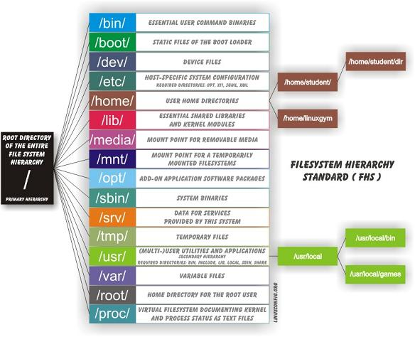

#### BASH Shortcuts ####
- `Tab`: Auto completes anything you're typing if possible.
- `clear` or `Ctrl+L`: clears the screen.
- `Ctrl+B` goes back one character / Ctrl+F goes forward one character (useful for navigating without taking hands off keyboard.
- `Ctrl+A` goes to beginning of line / Ctrl+E goes to end of the line.
- `Ctrk+D` acts like Delete key and lets you delete without taking your hands off keyboard.
- `Ctrl+U` kills everything before cursor on the line. (Ctrl+eu goes to the end then clears it quickly). Again, paste-able.
- `Ctrl+K` kills everything after the cursor. Let's you paste it.
- `Ctrl+Y` yanks the cut data on the kill ring; pasting it.
- `Ctrl+P` brings up previous command / Ctrl+N  brings up previous command.
- `Ctrl-R` lets you search through all your previously used commands.
- `Ctrl-C` kill whatever's running.
- `alias`: Lets you change names of commands or batch settings. Instead of typing `cygstart presentation.xls` you can `alias open='cygstart'`, then you can just type `open presentation.xls`.  To check your current lists of aliases, just type: `alias`. To get them to be permanent the alises need to be added to you .bashrc file though.
- `unalias`: removes aliases from list. If the above example was previously defined, `unalias open` would delete it. 
- `command` is used to temporarily ignore aliases: just start the command with `command`. For example my `rm` is aliased to `rm -i`, forcing it to be interactive. If I delete a folder with `rm -r FOLDER`, it's really annoying to confirm all the deletions. Instead I use `command rm -r FOLDER` and it cleanly removes it. In this exmaple, the other way to force it is to use the "-f" option to force it all.
- reload .bashrc after making updates: use the `source <full path to .bashrc>` i.e. `source ./.bashrc`.

#### BASH Commands ####
- `cd` = change directory. If you do it without any arguments it will take you to root. cd - = go back to previous directory.
- `ls` = list contents. `ls -a` shows hidden files. `ls -alrth` gives you the entire list with the user rights too.
- `cat filename` = quickly print the file contents to screen, there's something like cat filename > dump.txt that lets you copy the contents to another file.
- `less` = even better than cat. It doesn't open the entire file (only the page you are looking at). Scroll up with "b" and down with spacebar.
- `>` = lets you "redirect" everything to a file. Example: env > variables.txt will dump all your environment variables into a text file for grep'ing. "1>" redirects the stdout of the program. "2>"  the stderr. "&>" redirects both stdout and stderr.
- `which` = tells you where the program is being run from. Example: which node would return /usr/bin/. Its useful for diagnose your env to make sure programs are being run from the right place (based on PATH). Especially when two versions of a program are installed in different places.
- `alias` = lets you save typing by using an alias, ex. alias ll='ls -alrth' allows you to type ll instead of ls -alrth to get the metadata of files. Aliases are stored in ".bashrc" file in your home directory.
- `rm -r directory` - removes a directory
- `mv` = moves files and rename files as well.
- `cp` = copies a file and can rename as well.
- `ln` = symbolic link, `ln -s path finalplaceforlink`, to effectively making one file appear in two places. Remember that the first argument is path, not file. So when you open the finalplaceforlink, it's just going to run that literal path. So if you create finalplaceforlink deeper in an additionaly dir, you'll have to start the path with .. to come back out of it. As an example, see how the emacs.d symlinking is performed in my [setup repo](https://github.com/dfeagans/setup/blob/master/setup.sh) for reference. This is better said as: If you create a relative path to a symbolic link, it will store it as a relative symbolic link.
- `env` = lists all your environment variables, which are the parameters (options) for bash to use (and other bash scripts and programs).
- `echo $[environment variable]` = That's the way you show the environment variables values. $HOME is critical and $PATH to used to search for programs to run, so you can just type git, not ~/bin/git. Another method is env | grep "variable_name".
- `export ENV_Variable="Setting"`. (no spaces is important) Sets environment variable to a value. You can append onto an existing one with `export Env_Variable=$Env_Variable:"New Stuff"`  an example would be `export PATH=$PATH:.` which adds the current directory to the $PATH. The home directory usually isn't on the path for security purposes, so just "./"-run it. Don't ever prepend the current directory to the path (ex. `Export PATH=/home:$PATH` as it likely will find your local programs first before the standard ones since it searches through the PATH sequentially (ex  1:2:3:4...). To permanently add these you have to put them in your .bashrc file that's in your home directory.
- `unset ENV_Variable` = Deletes environment variable.
- `wget` and `curl` retrieve files from online sources. wget can recursively spider download from sites, but curl handles more protocols.
- `grep` searches for a word within a file, ex. `grep 'test string w/ spaces' document.txt` or `grep nothingspecial test.txt`. Can exclude lines using -v argument (example: `grep "this word" file | grep -v "not the line with this word though")`. `grep -l word *.txt` would return all txt files that contain "word". `grep -B 5 -A 2 <word> <file>` would return 5 lines before the word match in file and 2 lines after.
- `diff file1 file2` = binary compares the files. Great for determining the difference in two code files.
- `uptime` = tells you how long your ssh connection has been on (first is the normal time, then time on the server).
- `nl` = numbers each line of the file. Useful for nl file.txt > file_with_numbered_lines.txt to put lines permanently.
- `head and tail` = return the first -n lines  or last -n lines of the file (`head -n20 file1.txt file2.txt` returns the first 20 lines of both files). -c20 option returns 20 characters. There's an option to do things like tail -n+3 file, which starts at the third line and shows until the end.
- `cut` = pulls data out of a table file using column references (combined with head and tail you can grab out a rectangle of data). Syntax is `cut -f# -d filename`. The # denotes the column to take could be a single one, multiples using comma  (ex. 1,5,40), and spread ex(1-50). The -d option is optional and specifies the delimiter (if there's no -d option, it defaults to tab), but could be -d',' or -d'.'. You can extract out a set number of characters with -c instead of -f, with a similar syntax: -c1-20 selects characters 1-20 in each row. -c1,3 extracts characters 1 and 3.
- `split` = splits large files into pieces. For example, "split -d -l 1000 file file.parts." would break "file" into 1000 line snippets (from the -l 1000 option), each called file.parts.1, file.parts.2, etc (from the -d option (numeric suffix) and the file.parts name.
- `paste` = copies together files using columns (will easily do multiple files too). Remember it just does the pasting to stdout, so it would have to get redirected (>) to a file.
- `sort` = sort -r is reverse. -R is randomize.
- `uniq` = this makes it only return the unique lines in the file. Often seen using `grep "Word" file | sort | uniq` to clean up grep results.
- `wc` - line, word, and character count. -l is line count. -L is longest line (useful for style checking).
- `&` = placed after a command lets you to continue running other commands while that ones running. 
- `ps` = returns a current snapshot of the running processes. First column is PID which is useful for kill. Lists in order of % time spent running / lifetime of process, so not really how stressful it is to CPU.
- `top` = lists all processes in order of actual CPU % utilization at that moment... I think. (more powerful than ps, but an actual program that has to be installed on linux ... not on cygwin).
- `kill` = kills running processes. easiest to use PID found using above ps command.
- `sudo` = when placed before the commands, it runs them as the root user.
- `sudo su` = Use sparingly. turns you into root user until you type exit or Ctrl+d.  
- `tar` = make an archive if files. You often tarball some files, then gzip it to compress it.
- `gzip` = awesome zipping tool. You can still view text files using zcat. 
- `gunzip` = unzip .gz files created using gzip.
- `find` = (non-indexed search) searches through file directories.
  - Example: `find /Homework -name hello*` returns all the files that start with hello in the Homework directory
  - Example: `find /etc | nl` would show all the folders under the etc directory and put number lines next to them.
  - Example: `find /Homework/hw1/hello*` would return all the files that start will hello in the folder
  - find doesn't appear that much different than ls in the previous examples. It's apparently useful for stuff like `find $HOME -mtime 0` which returns all the files modified in the last 24 hours (that's the 0 argument). See the man page.
- `locate` = (indexed search) searches through an index (search database), like Windows. Use sudo updatedb to update the search index. Much like windows wildcards are added before and after your word to make it specific using locate -b hello*.
- `df` = system disk space for all the mounted directories.
- `du` = directory utilization. `du --max-depth=1 -b | sort -k1 -rn` shows a list of the largest directories taking up space. --max-depth is pretty dope, it makes it makes it ignore subdirectories. -b shows it in bytes. -rn makes it sort in reverse so that the largest is on top.
- `sed` = simple and crazy powerful character replacement program. People use it for some [crazy stuff](http://www.catonmat.net/blog/wp-content/uploads/2008/09/sed1line.txt), converting windows CSV files to files with proper carriage returns, adding double spacing to lines.
  - `sed -i 's/word/newword/g' filename` = replaces word with newword globally (/g at end) permanently in file (-i means in-file replacement.
  - `sed -i '/baz/s/foo/bar/g' filename' = replaces all cases of foo with bar only if line also contains baz.
  - `sed -i '/baz/!s/foo/bar/g' filename` = replaces all cases of foo with bar only if line doesn't contain baz.
- `awk` = advanced substitution and short scripts. [Useful awk reference](http://www.pement.org/awk/awk1line.txt). Apparently the fastest way to operate on tab-delimited data before pushing it ino a database.
- `backticks` = "\`"(below "~" tilda key) - returns the results of the bash command between the backticks so you can use it as the input to another command. Example: `echo \`hostname\`` or `echo "The date is "\`date\``).
- `xargs` = allows you to execute commands from STDIN... hard to understand, but find etc -name *.sh | head -2 returns the first 2 files found that end in .sh. find /etc *.sh | xargs head -2 actually shows the first 2 lines of all the files found. It's often used with find or ls to run commands on all the files found.
- `tee` = like > but tee's into the stream. [Reference](http://linux.101hacks.com/unix/tee-command-examples/). It creates the file, but will continue the stream along for further commands. Example: `ls | tee all_files | grep node | node_files` lists all the files saves them to a file called all_files, then searches the STDOUT for ones with "node" in it and saves them to a file called node_list.
- `time` and `/usr/bin/time` (two separate commands) = time just tells you how long it took to run the command (ex. `time sleep 2` will return around 2 seconds). `/usr/bin/time` is much detailed and returns the number of memory puts too.

#### Piping Inputs ####
There are STDIN (binary data input - usually keyboard), STDOUT (standard output - screen), and STDERR (error messages):
- STOUT gets redirected using ">" (ex. `env > test.txt` pushes the list of environment variables to test.txt)
- STDERR gets redirected using "2>" (ex. `curl fakeurlmissing_dotcom 2> err.txt` pushes ONLY the error messages to err.txt)
- STOUT and STDERR may be redirected using "&>" (ex. `curl google.com fakeurlagain &> both.txt` pushes both the successful and failing message to both.txt)
- A pipe connects the STDOUT to the STDIN of the next command (`env | grep PATH` passes the results of env into the grep to search for "PATH")

#### scp (Secure Copy over SSH) ####
Both examples below assume your ssh-config is set-up as I noted in the Configs >
1.Copy a local file to the login directory of the remote host:
scp test.txt aws:    (everything after the semi-colon specifies the directory and newnameso this puts text.txt in your home. It could be scp test.txt aws:~/.ssh/ and that would copy it to .ssh folder. It could also be scp test.txt aws:~/.ssh/newname.txt for a rename too)
2.Copy a remote file into a subdirectory on the local host (and current directory) on which you have an account under the same user name:
scp aws:~/testfolder/test.txt .
If you want to copy an entire directory use the r-flag to copy recursively.
So basically: scp FileIWant PlaceIWantIt with the remove stuff being aws:blah/blah/blah.txt
If you wanted to do a directory, it's scp -r blah toblah

#### Piping over SSH ####
http://linux.icydog.net/ssh/piping.php - badass stuff like execute scripts from remote sites onto the screen of your local computer.

#### chmod (Change Mode) options ####
Example: in `chmod 777 text.sh` there are three numbers and each of them is octal.
The first number controls the previleages for "user", the second group controls "group" and the final number controls "other". There are three different privelages that can be done with a file: read, write, and execute. Here is a little reference:

execute = 001 in binary = 1 in octal  
write = 010 in binary = 2 in octal  
read = 100 in binary = 4 in octal

So where does the 7 come from?
7 in binary = 111 in decimal = read, write, execute

So all the different privelages avaiable are:  
- read-write-execute = 111 = 1 + 2 + 4 = 7
- read-write+NO execute = 110 = 4 + 2 = 6
- read-NO write-execute = 101 = 4 + 1 = 5
- read-NO write-NO execute = 100 = 4
- NO read-write-execute = 011 = 2 + 1 = 3
- NO read-write-NO execute = 010 = 2
- NO read-NO write-execute = 001 = 1
- NO read-NO write-NO execute = 000 = 0

#### Basic Ubuntu File System ####
Folder Structure of Ubuntu: https://help.ubuntu.com/community/LinuxFilesystemTreeOverview  
The standard Ubuntu directory structure mostly follows the [Filesystem Hierarchy Standard](http://www.pathname.com/fhs/), which can be referred to for more detailed information.

Instead of the "\" in Windows, Linux utilizes the "/":  

- /bin is a place for most commonly used [terminal](https://help.ubuntu.com/community/UsingTheTerminal) commands, like ls, mount, rm, etc.
- /boot contains files needed to start up the system, including the [Linux kernel](https://help.ubuntu.com/community/Kernel), a RAM disk image and [bootloader](https://help.ubuntu.com/community/GrubHowTo) configuration files.
- /dev contains all device files, which are not regular files but instead refer to various hardware devices on the system, including hard drives.
- /etc contains system-global configuration files, which affect the system's behavior for all users.
- /home home sweet home, this is the place for users' home directories.
- /lib contains very important dynamic libraries and kernel modules
- /media is intended as a mount point for external devices, such as hard drives or removable media (floppies, CDs, DVDs).
- /mnt is also a place for mount points, but dedicated specifically to "temporarily mounted" devices, such as network filesystems.
- /opt can be used to store addition software for your system, which is not handled by the [package manager](https://help.ubuntu.com/community/InstallingSoftware).
- /proc is a virtual filesystem that provides a mechanism for kernel to send information to processes.
- /root is the [superuser](https://help.ubuntu.com/community/RootSudo)'s home directory, not in /home/ to allow for booting the system even if /home/ is not available.
- /sbin contains important administrative commands that should generally only be employed by the superuser.
- /srv can contain data directories of services such as HTTP (/srv/www/) or FTP.
- /sys is a virtual filesystem that can be accessed to set or obtain information about the kernel's view of the system.
- /tmp is a place for temporary files used by applications.
- /usr contains the majority of user utilities and applications, and partly replicates the root directory structure, containing for instance, among others,/usr/bin/ and /usr/lib.
- /var is dedicated variable data that potentially changes rapidly; a notable directory it contains is /var/log where system log files are kept.

#### Kill Process Running on Port ####
Find the process runing on the port, for example searching port 8080: `sudo netstat -lpn |grep :8080`  
Then kill it using the number: `kill <number,possibly four digits of program>`

#### Burn Music CD's from MP3's (lame must be installed): ####
Put all the mp3's in one folder, then to convert them all to WAV format use: `for song in *.mp3; do lame --decode "$song"; done`    
Then I used Brasero (the default graphical burner in Ubuntu) to burn it. There's a command line burner called cdrdao, but I didn't use it. The commands to use it where `mktoc -w *.wav > album.toc` then `cdrdao write album.toc`, but I haven't tested it.
