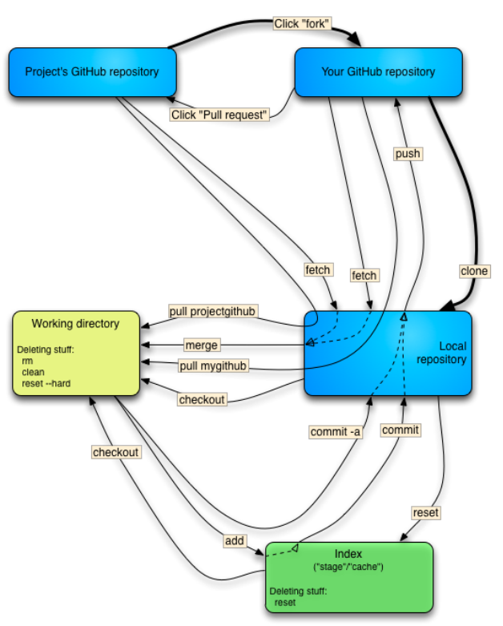
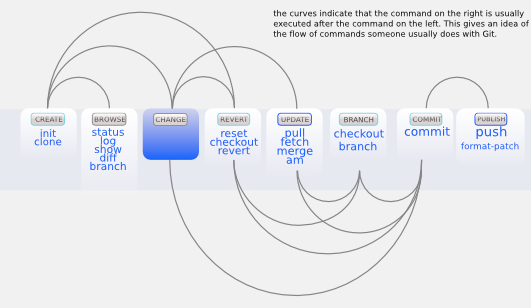

### GIT Revision Control ###
Best Tutorial http://githowto.com/  
Interactive Tutorial  http://try.github.io/levels/1/challenges/
  
**Setting up the initial Github connection**: Reference the setup.sh in the end of the [AWS Setup Script](https://github.com/dfeagans/setup).

#### Create a repo ####
* **(START FROM EXISTING LOCAL REPO)** - `git init` - makes your current directory into a git repo, that you can then push up to github. AT github.com create an empty repo and copy the sshURL. git remote add origin sshURL then git push -u origin master will push to that directory.
* **(START FROM EXISTING GIT REPO)** - `git clone sshURL (or normal URL)` pulls down a repo from github and lets you start immedietely working. This is an example url for my "Angelito" repo: git@github.com:dfeagans/Angelito.git or for cloning general repos: https://github.com/startup-class/dotfiles. It will NOT overwrite an existing folder.To be able to push back to the repo, you have to use the SSH url. It's possible to change the remote from the https one to the SSH one after the fact though:
* `git remote set-url origin sshURL` - changes the remote url after the fact. This was useful during the set-up.sh because I won't have ssh access to github in the beginning, so I have to git clone https, then I have to change it to use the sshURL so that I can push using my ssh keys instead of username/password.

#### Add Changes ####
* `git add` adds files to the git "staging area" to be tracked by git. You will have to commit them though. `git add .` adds the current directory's eligable contents. You can git add specific files (`git add index.html`) and even use wildcards (`git add *.txt`).
* `git commit -m "message for commit"` actually adds the commit. Do this one at a time with each part. 
* `amend`: To revise a git commit message, use `git commit --amend -m "revised commit message"` immediately after doing the commit (before staging anything else). If you stage any modifications and run that command then it just rolls the additional changes in with the previous commits. In a case like that, if you were just fixing a typo or something, then using `git commit --amend --no-edit` just adds the additions while keeping the commit message the same.
* `git push -u origin master` - pushes files to the origin repo (github). The -u saves the settings so that you just have to type `git push` next time.
* `git push -f origin some_branch` - If you do an amend to a commit that's already been pushed then you're then doing a normal push would cause a merge conflict. If you're just working by yourself, you use the force option to push your local branch state up to the remote. Not good if other people are working on the same branch though.

#### View Changes ####
* `git status` lets you know how which files you are/aren't tracking.
* `git log` gives you all the details for the recent commits. git log --pretty=oneline shows everything a bit cleaner. `git log --all --pretty=format:"%h %cd %s (%an)" --since='7 days ago'` shows all the changes from the past week.
* `git log --pretty=format:"%h %ad | %s%d [%an]" --graph --date=short` is the pretty darn good though. I have this setup as `git hist` using an alias (see install config notes for instructions). `git log -p --color Filename` shows the entire revision list for that file with the commit notes and the modifications listed.
* If you want to add a git hist write to the config file you can use this one: `git config --global alias.hist "log --pretty=format:'%C(yellow)[%ad]%C(reset) %C(green)[%h]%C(reset) | %C(red)%s %C(bold red){{%an}}%C(reset) %C(blue)%d%C(reset)' --graph --date=short"`
* `git diff` tells you specifically what has changed in modified files that aren't staged yet. git diff --staged (shows the changes for just the files you're about to commit). git diff filename.html shows the specific files revisons. You can even git diff two versions using their hashes. Use q to quit. git diff HEAD shows most recent revisions.
* `git show` lets you look at complete previous files using just the hash!

#### Undo Changes ####
* `git reset filename` (git add undo) removes a file's changes from git's staging area local copy remains modified. 
* `git reset --hard` resets all the files that were tracked in git. Use this sparingly.
* `git checkout -- filename.txt` (modification undo) discards your modifications to filename.txt and pulls the last checked in fiilename.txt from your repo. The -- controls the branch you are pulling from. I think it automatically pulls from your HEAD. If it wasn't there it might pull from a branch called filename.txt.
* `git checkout <hash>` lets you pull up and previous file from a commit. Get the hash code from `git log` (or better yet `git hist`).
* `git revert HEAD` (commit undo) lets you cancel your last actual commit. It does add a "revert" comment to the log. It doesn't just take the previous commit out.
* `git reset --hard HASHorTAG` (delete commit) removes the commit from the normal log. The commit you removed with still show up with `git log --all`. To delete it from there use `git tag -d TAG`.
* `git remote show origin` - this shows where your repo is copy to/from. C9 is automatically set up. You would have to `git remote add origin URL` otherwise. If you create a repo in git and then use the URL to create a workspace by cloning from URL, it's already pointed to the correct origin.
* to pull files from github (say a friend modified github) you do `git remote update` or `git pull origin master` to pull from a specific remote repo.
* to change a bunch of old commit messages, use `git rebase --interactive PARENT_OF_FLAWED_COMMIT`. Then change pick to reword for all the ones you want to change (close and save). Then it will open a file for each commit you wanted to change... Change, Save, and Close each one.

#### Branches ####
* **Point of Branch and Merge** - maintain a master branch and a dev branch, do different kinds of development in dev and then merge the changes back into main later. After doing the work in the dev branch, `git checkout -- master` then `git merge dev` to bring them in (i think you then need to add and push).
* `git branch` lets you see all available branches of your code . The "*" denotes your currently selected one. `git checkout branch_name` checks out and changes to branch_name branch. BRANCHING IS LIKE SAVE AS. `git checkout -b branch_name` does branch and checkout simultaneously to make things easier. `git push origin branch_name` pushes your new branch to repo.
* `git merge test`, if ran from example_branch (get in the example_branch by running `git checkout example_branch`), merges test's modifications to example_branch. git merge by default does a fast-forward merge and just tacks your stuff onto the end if possible. If you want to actually show that you were working in a different branch and show the true merging of the development paths, use the `--no-ff` option. ?>i think you would have to `git checkout -- filenames_to_be_unmodified` to get rid of your modifications<?. Then you have to git add those files, commit, and push as normal.
* `--squash` - "git merge --squash branch_name" merges everything, but allows you to just do one commit, so then you add, commit, and push. It hides all the commits that occured within the branch aka "micro-commits".
* The proper way to use branches is to work on a development branch, ex. devDF. Then once I get done with the feature, merge to master by `git checkout master`, then `git merge --no-ff devDF` (-squash if needed). You can push that branch up with `git push origin devDF`. 
* `git rebase master`, if ran from a different branch, changes the master tree to that of the branch, so it's linear as opposed to merging. Just a little cleaner. Rebase is good for local changes, stick with merges for the public repos, that way you don't affect everyone elses trees. If you do `git rebate -i` it's the interactive mode that lets you squash, delete, or change the commits along the way.
* `git branch -D BranchName` - deletes the branch from your local computer.  Deleting the branch is necessary after your done playing in it.
* `git push origin :BranchName` - deletes the branch from the github page.

#### Misc ####
* `git tag TAG` lets you tag releases like v1, v1.1, etc. Then you can get the version previous to v1 using git checkout v1^ or just get a specific release git checkout v3.1. git tag views your current branches tags.
* `git tag -f TAG` is how you "move" the tag from one commit to the current one. Say you've tagged a commit but then made an update. That command will force that new commit to be tagged, not the old one.
* `git push -f --tags` is per usual dangerous if you're working with others, but this pushes any tag changes up. It would be required if you did the aforementioned command that moves a tag to a new commit.
* `git rm filename.blah` not only removes the changes, but also completely removes the file from the changing area. The deletion of the files will show up in the commit.
* `git mv filename newname` - lets you rename a file and track it appropriately in git. If you just use mv, it will add a delete file added file revision to your git tree.
* `git remote show origin` - shows you everything about the project you're working on: where it's pushing too, different branches, status of each branch locally, etc.
* If ever needed this is how you compress a bunch of commits into one commit comment to make them cleaner: http://stackoverflow.com/questions/5189560/how-can-i-squash-my-last-x-commits-together-using-git.
* Also you can force update a server using the "+" character before the branch name. For example git push origin +master, but don't do this blindly.

#### Working using two computer and github to host the repo ####
* use `git pull` to download everything from github and ensure the computer you're working on is up to date.
* develop code and use git add/commit/push origin master to get your code onto github.
* change to your other computer and use `git pull` to make sure you're up to date again.

#### Quick Summary ####

* `git init` turns git "on" in the directory you're currently located in. The below notes are how you get it all up and running:
```bash
cd <localdir>
git init
git add .
git commit -m 'message'
git remote add origin <url>
git push -u origin master
```



#### Github Pages Hosting ####
https://help.github.com/categories/20/articles or http://www.thinkful.com/learn/a-guide-to-using-github-pages/  
You can make github host a webpage for your project. It's really for hosting a documentation webpage for your project, but I used it to host the project itself. To host it, you just need to have an html file in a gh-pages branch.

##### Separate site #####
`git checkout --orphan gh-pages` will create a fresh branch with no history on it. `git rm -rf .` will remove all the files from your working tree. Then you create your html and supporting files, git add them, git commit them, and then finally push them to the gh-pages branch on the server using: `git push origin gh-pages`

##### Host your actual project: #####
`git branch gh-pages` (this unlike --orphan will keep your compete tree going, so you can remerge it).
`git checkout gh-pages` make some random change, `git add`, `git commit`, and finally `git push origin gh-pages` on github using `git push origin gh-pages`. Note that it will host the file called index.html.

After 10 minutes or so, Github will start hosting it under: username.github.io/projectname

I initially used this for developing an app, but commits to the repo on github.com take time to get up, so it doesn't work well. Only use them for documentation websites moving forward. Locally develop your site instead.

#### Cloud9 IDE - Cloud Hosted IDE (I originally used Cloud 9, but eventually put everything on AWS) ####
Cloud9 and Git -  https://www.youtube.com/watch?v=vnXi0gGTVS8  - This shows how to used C9 with Github (both pushing a repo from C9 to Github and pulling a repo from Github to C9). You can use Git on the C9 terminal, so you don't have to install it on your comp.
 
**New Workspace Creation (methods taken from video above):**  
- **Option 1: Clone from github URL** - create a repo in Github first. In Cloud9 create a new workspace and choose the second option of "Clone from URL" then paste in the SSH URL from Github. Your GIT is already linked up (you have read/write access to Github. So you can make changes, add, commit, and push immedietely. The command line version of this is git clone <ssh url>.  
- **Option 2: New Cloud9 Repo or any computer for that matter** - github Starting with your code in Cloud9 already, create a Github repo on github. Again copy the SSH url. In cloud9 use git remote add origin URL to link it and to push. This is  what you have to do if you're working locally on your computer instead of Cloud9.

#### Notes from Pro Git ####
Git commits a snapshot of everything you staged on the index. This allows branching which was previously hard to do in old systems that just saved literally the changes.

Git does lots of things locally since you clone the entire repo. This makes `git diff` and `git log` work really quickly because it's not querying a database for files and comparing them.

**Files have three states in GIT: Modified,Staged,Committed:**
- **Modified** - File is modified and not currently tracked by git. The change won't be stored in gits snapshot of the files.
- **Staged** - The file is modified and will be tracked by git on the next commit, thus permanently saving the changes.
- **Comitted** - The data has been "checked-in" to your local database and the revision is added to the your project's history.

**Git Config File** - There are several config files, a global one for everyone on the computer, a user one specifically for you, and a repo one for each specific repositiory. The more specific configs override the global ones.
- **Setting user.name**: `git config --global user.name "<firstName> <lastName>"`
- **Setting user.email**: `git config --global user.email <name.lastName@gmail.com>`
- **Check Current Config Settings**: `git config --list`
- **Check Individual Config Settings**: `git config user.name`

**Tracked/Untracked** - Files are always either tracked or untracked. It's not back to not track files, like binaries or reference files. It's kind of like the "continue" in Creo Windchill. You check which files are tracked with `git status`. Files can be tracked, modified, but not staged for commit. This allows you to incrementally commit things. It's possible to use a .gitignore file to set rules to never track temporary files, binary files, or other extensions. Just create a text file called ".gitignore" in the directory and add the names of the files you want to ignore, wildcards work. It works with wildcards, so I often put "*~" in there to ignore all the emacs backup files. I also put "node_modules" in there. If I was going to deploy using git, I'd put all the modules in there, but if you manage the modules with npm you can just download them when needed. So ignoring "node_moduels" saves memory/bandwidth.

`git diff` by itself will tell you what's changed and not staged. git diff -staged lets you know what changes were made to the files in the staging area.

**Forgot to add file to a commit** - `git add` the file and then use `git commit --ammend 'message'`  
**Erase your changes to a file** - `git checkout -- filename`. Again the filename specifies the branch I think, but you'll rarely use a different branch.
