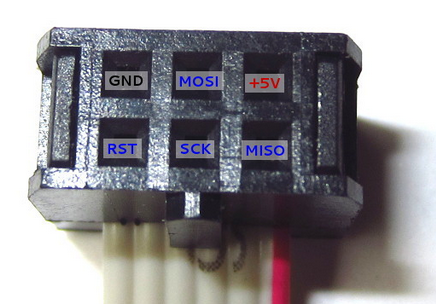
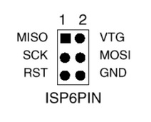

## AVR Microcontroller Ubuntu Set-up: ##
I installed directly from the Ubuntu software center (could command line too).
- **gcc-avr** - Actual C-compiler for AVRs. avr-objcopy is needed as well, but it comes with gcc-avr. It's used to turn the compiled code into the actual hex code for the avr.
- **avr-libc** - Common code library for AVRs.
- **avrdude** - Actually puts code on your avr. uisp is an older alternative. 

Software Set-up: http://www.micahcarrick.com/tutorials/avr-microcontroller-tutorial/getting-started.html  
Hardware Set-up: https://www.sparkfun.com/tutorials/category/1

### avr-gcc Settings: ###
```
avr-gcc -mmcu=atmega328p -Wall -Os -o test.elf test.c
     "-mmcu=atmega328p" = defines the microcontroller to compile for.
     "-Wall" = turns on all reasonable compiler warnings.
     "-Os" = the flag for the compiler to optimize for efficient memory utilization.
     "-o test.elf" = defines the name of the output file.
     "test.c" = the actual file to compile.
```

### avr-objcopy Settings ###
```
avr-objcopy -j .text -j .data -O ihex test.elf test.hex
     "-j .text -j .data" = specifies the "memory sections" from the elf file. text contains the actual machine code instructions. data contains constants,strings,etc.
     "-O ihex" = specifies the output format as Intel hex.
     "test.elf test.hex" = specifies the input file, then output file name's respectively.
```

### avrdude Settings ###
```
sudo avrdude -p m328p -c avrispmkII =e -U flash:w:test.hex
     "-p m328p" = defines which microcontroller is getting programmed. To find out list of supported micros, run avrdude -p ?
         "-c avrispmkII" = defines which programmer is doing the programming. To find out list of supported micros, run avrdude -c ?
         "-e" = erase the flash first.
         "-U flash:w:test.hex" = tells avrdude to write text.hex to flash memory.
```

#### AVRISP MKII Pinout ####


#### Programmer Header Pinout ####


I have jumpers connected to the programmer header than put all the pins into a row because some AVRs have the pins right next to each other in the following order:
```
1 - Red - MOSI (Master Out Slave In)
2 - Red - MISO (Master In Slave Out)
3 - Blue - SCK (Slave Clock)
4 - Blue - Reset
5 - Yellow  VCC
6- Black - GND
```
